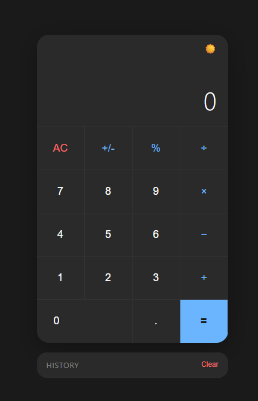

🧮 NYG Calculator - Project start 10/04/26 - 13:00

A clean and minimalist calculator built with pure HTML, CSS and JavaScript.

📸 Preview

</img>

✨ Features

- ➕ Basic operations — addition, subtraction, multiplication, division
- 💬 Expression display — shows the full expression while typing
- 📋 Calculation history — keeps track of past results
- 🧹 Clear history — reset history with one click
- ➕➖ Sign toggle — switch between positive and negative
- 💯 Percentage — context-aware percentage calculation
- 🔢 Decimal support — validated decimal point input
- ❌ Error handling — displays "Error" on division by zero

🛠️ Built With

![HTML5]
![CSS3]
![JavaScript]

📁 Project Structure

NYG-Calculator/  
├── index.html     → Page structure  
├── style.css      → Visual styling  
├── script.js      → Calculation logic  
└── README.md      → Project documentation

👤 Author

**Yuri** — [@NyG007](https://github.com/NyG007)
